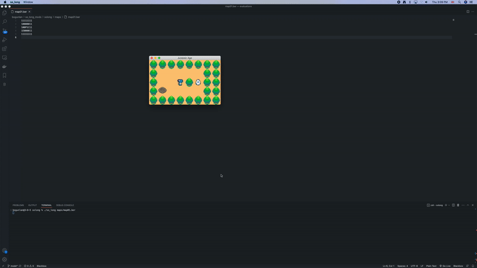
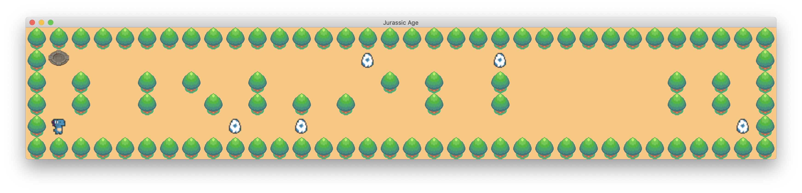

# So Long

## Description

This project is a small 2D game designed to improve computer graphics skills. It involves working with textures, sprites, and basic gameplay elements. The objective is to create a game using the MiniLibX library, focusing on window management, event handling, colors, textures, and more.


## Gameplay Sample



## Game Rules

- The player's objective is to collect all the collectibles on the map and then escape by choosing the shortest route.
- Use the `W`, `A`, `S`, and `D` keys to move the main character.
- Movement is restricted to four directions: up, down, left, and right.
- The player cannot move through walls.
- The current number of movements must be displayed in the shell after each move.
- The game should be viewed in a 2D perspective (top-down or profile).
- The game does not need to be real-time.
- The theme and world of the game can be customized.

## Graphic Management

- The program displays the game's visuals in a window.
- Window management should be smooth, allowing seamless switching, minimizing, and other operations.
- Pressing the `ESC` key should close the window and exit the program cleanly.
- Clicking on the window's cross (`x`) button should also close the window and exit the program cleanly.
- The use of images provided by the MiniLibX library is mandatory.

## Map Construction

- The map consists of three components: walls, collectibles, and free space.
- The map is represented by the following characters:
  - `0` for an empty space,
  - `1` for a wall,
  - `C` for a collectible,
  - `E` for the map exit,
  - `P` for the player's starting position.
- The map must contain at least one exit, one collectible, and one starting position to be considered valid.
- Duplicate characters for the exit or starting position should display an error message.
- The map must be rectangular in shape.
- The map must be enclosed/surrounded by walls; otherwise, the program returns an error.
- A valid path must exist within the map.
- The program should be capable of parsing any valid map format, and if any misconfiguration is encountered, it should exit cleanly and return an "Error\n" message followed by an explicit error description of your choice.


Sample of `valid` map
``` bash
1111111111111111111111111111111111
1E0000000000000C00000C000000000001
1010010100100000101001000000010101
1010010010101010001001000000010101
1P0000000C00C0000000000000000000C1
1111111111111111111111111111111111
```

## Usage Example

To run the game with a sample map, use the following command:

```
./so_long maps/map02.ber
```

## Screenshot


<h2>Credits</h3>
This project is part of the curriculum at <a href="https://www.42heilbronn.de"></a>, a coding school that fosters peer-to-peer learning and project-based education.

